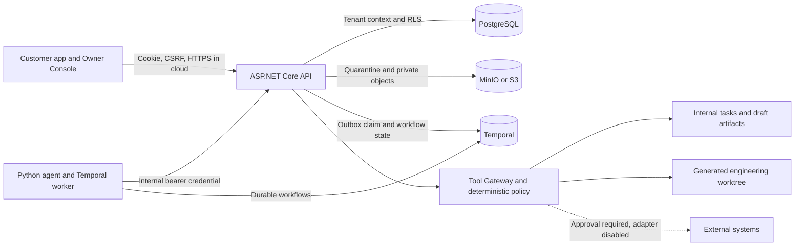
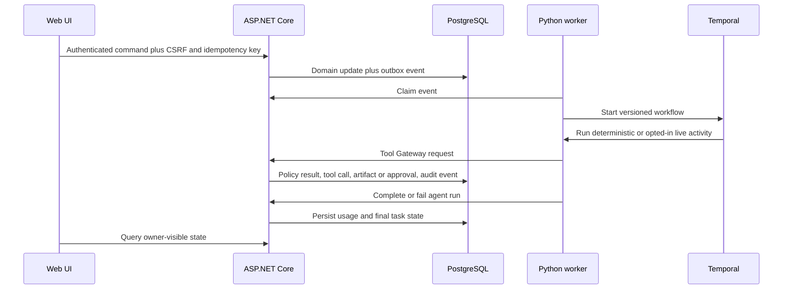

# F0 architecture overview

## Runtime topology

## Trust boundaries

1. The browser has customer or platform-owner authority, never internal-service authority.
2. The Python worker has only an internal service credential and cannot make owner decisions or connect directly to application PostgreSQL.
3. PostgreSQL is authoritative. Tenant-owned rows use transaction-scoped organization context and row-level security.
4. Model output is untrusted structured input. It is validated by Pydantic, constrained by role-specific tool permissions, and materialized only through Tool Gateway.
5. Policy evaluation is deterministic .NET code. An LLM never decides authorization.
6. External adapters are registered for truthful policy and approval behavior but technically disabled in F0.
7. Engineering changes are restricted to a generated fixture worktree, exact command arrays without network targets, bounded output, blocked secrets, and fail-closed child-process proxy settings.

## Durable data flow

The customer app never exposes internal agents, approvals, prompts, traces, or unrelated internal tasks. The Owner Console shows concise rationale and exact action payloads, not chain-of-thought.
