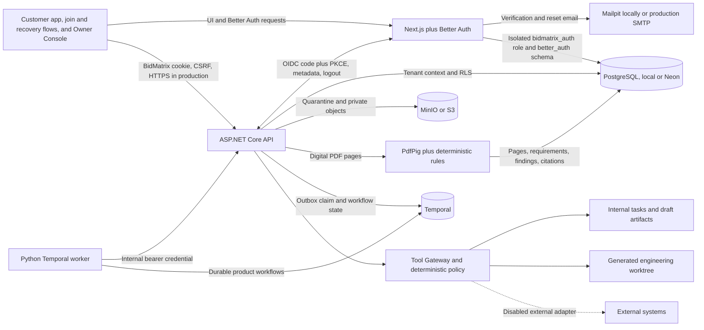
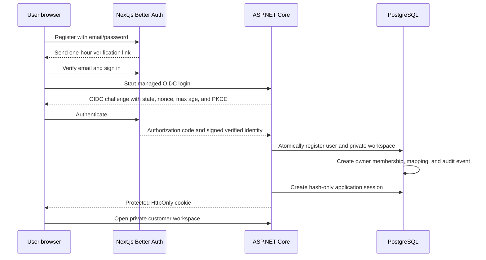
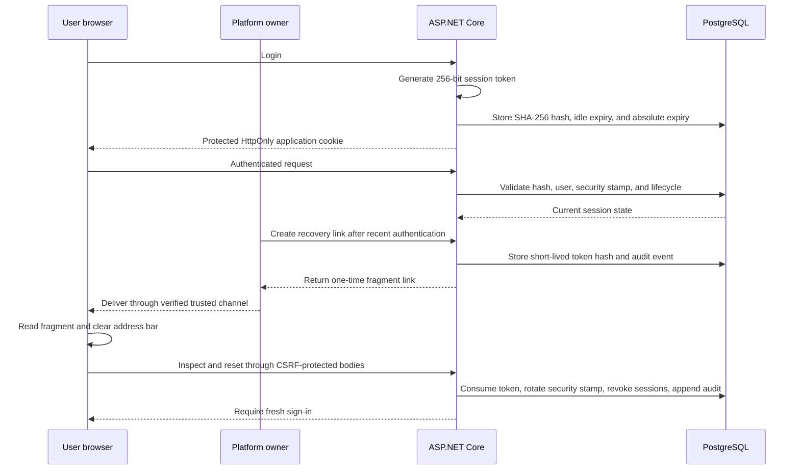
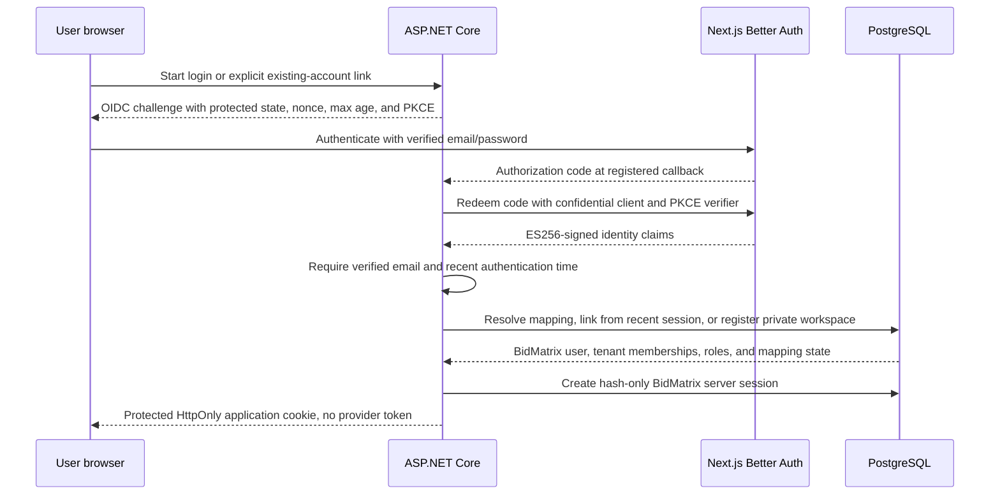
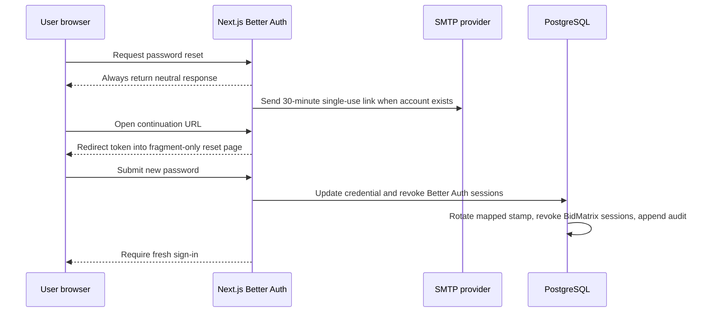
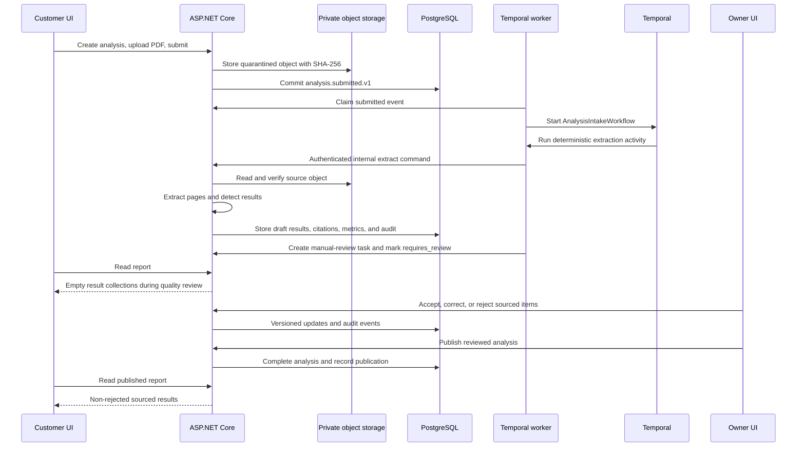
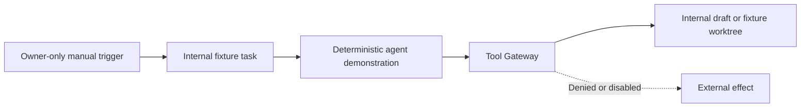

# F2, S0, and S1.1 architecture overview

## Runtime topology

```mermaid
flowchart LR
    Browser["Customer app, join and recovery flows, and Owner Console"] -->|"UI and Better Auth requests"| Web["Next.js plus Better Auth"]
    Browser -->|"BidMatrix cookie, CSRF, HTTPS in production"| API["ASP.NET Core API"]
    API <-->|"OIDC code plus PKCE, metadata, logout"| Web
    Web -->|"Verification and reset email"| SMTP["Mailpit locally or production SMTP"]
    Worker["Python Temporal worker"] -->|"Internal bearer credential"| API
    API -->|"Tenant context and RLS"| PG[(PostgreSQL, local or Neon)]
    Web -->|"Isolated bidmatrix_auth role and better_auth schema"| PG
    API -->|"Quarantine and private objects"| S3[(MinIO or S3)]
    API -->|"Digital PDF pages"| Extractor["PdfPig plus deterministic rules"]
    Extractor -->|"Pages, requirements, findings, citations"| PG
    Worker -->|"Durable product workflows"| Temporal[(Temporal)]
    API -->|"Outbox claim and workflow state"| Temporal
    API --> Gateway["Tool Gateway and deterministic policy"]
    Gateway --> Drafts["Internal tasks and draft artifacts"]
    Gateway --> Sandbox["Generated engineering worktree"]
    Gateway -. "Disabled external adapter" .-> External["External systems"]
```

The Python process is named `agent-worker` in Compose for historical F0 compatibility. In the F2 customer path it acts as a deterministic Temporal workflow worker. Extraction, review state, and publication authority remain in the ASP.NET Core and PostgreSQL boundary.

## Trust boundaries

1. The browser has customer or platform-owner authority, never internal-service authority.
2. The Python worker has only an internal service credential and cannot make owner decisions or connect directly to application PostgreSQL.
3. PostgreSQL is authoritative. Tenant-owned rows use transaction-scoped organization context and row-level security.
4. F2 extraction is deterministic and runs inside the API boundary. Raw PDF bytes and extracted page text are not sent to a model.
5. Customer results remain hidden until an authenticated owner publishes them.
6. Policy evaluation is deterministic .NET code. A model never decides authorization.
7. Existing agent output is untrusted structured input. Agent demonstrations are manual, deterministic, internal-only regressions during the SaaS-first sequence.
8. No agent schedule is enabled. Agents cannot set company goals, priorities, customer decisions, or publication state.
9. External adapters are registered for truthful policy behavior but remain technically disabled.
10. Engineering demonstrations are restricted to a generated fixture worktree, exact command arrays without network targets, bounded output, blocked secrets, and fail-closed child-process proxy settings.
11. Every application cookie carries a random session token inside ASP.NET Core data protection. PostgreSQL stores only the token hash and validates user status, credential security stamp, revocation, idle expiry, and absolute expiry for every authenticated request.
12. Users can act only on sessions owned by their account. Password change and recovery rotate the credential security stamp and revoke every session.
13. Native recovery is a temporary Development mechanism. Only a recently authenticated `platform_owner` can issue or revoke a short-lived link, the browser clears its fragment before inspection, and successful use consumes it once without automatic sign-in.
14. Hosted authentication uses Better Auth with server-side OIDC authorization code plus PKCE. The current customer method is verified email/password. Google and GitHub remain deferred configuration options. Provider tokens never enter BidMatrix browser storage.
15. A new provider identity can create only a new private workspace with a fixed `owner` membership. It cannot join an existing workspace or grant a platform role.
16. Existing-account linking requires a recent session and verified email equality. BidMatrix stores only issuer plus subject hash and remains authoritative for users, memberships, roles, sessions, and audit.
17. Hosted PostgreSQL uses a dedicated Neon project. Runtime roles use the pooled endpoint while controlled migrations use the direct endpoint, with `VerifyFull` TLS, required channel binding, distinct credentials, and no RLS bypass.
18. Better Auth runs inside Next.js through `bidmatrix_auth`. It cannot read BidMatrix users, memberships, roles, sessions, or audit tables.
19. Better Auth verification and recovery email leaves the server only through configured SMTP. Hosted startup requires HTTPS and authenticated TLS SMTP. Development uses Mailpit and never auto-verifies a customer account.
20. A Better Auth credential-password update invokes a narrow fixed-search-path database trigger. The trigger rotates only the mapped BidMatrix credential stamp, revokes mapped application sessions and pending native recovery tokens, and writes a token-free audit event in the same transaction.

## S1.0 self-service registration flow

```mermaid
sequenceDiagram
    participant U as User browser
    participant Auth as Next.js Better Auth
    participant API as ASP.NET Core
    participant DB as PostgreSQL
    U->>Auth: Register with email/password
    Auth-->>U: Send one-hour verification link
    U->>Auth: Verify email and sign in
    U->>API: Start managed OIDC login
    API-->>U: OIDC challenge with state, nonce, max age, and PKCE
    U->>Auth: Authenticate
    Auth-->>API: Authorization code and signed verified identity
    API->>DB: Atomically register user and private workspace
    DB->>DB: Create owner membership, mapping, and audit event
    API->>DB: Create hash-only application session
    API-->>U: Protected HttpOnly cookie
    U->>API: Open private customer workspace
```

Registration creates no platform role, agent task, model request, schedule, Tool Gateway call, or external effect. Development captures verification email in Mailpit and never auto-verifies the account. Hosted startup fails closed without HTTPS and authenticated TLS SMTP.

## S1.1 session and recovery flow

```mermaid
sequenceDiagram
    participant U as User browser
    participant O as Platform owner
    participant API as ASP.NET Core
    participant DB as PostgreSQL
    U->>API: Login
    API->>API: Generate 256-bit session token
    API->>DB: Store SHA-256 hash, idle expiry, and absolute expiry
    API-->>U: Protected HttpOnly application cookie
    U->>API: Authenticated request
    API->>DB: Validate hash, user, security stamp, and lifecycle
    DB-->>API: Current session state
    O->>API: Create recovery link after recent authentication
    API->>DB: Store short-lived token hash and audit event
    API-->>O: Return one-time fragment link
    O-->>U: Deliver through verified trusted channel
    U->>U: Read fragment and clear address bar
    U->>API: Inspect and reset through CSRF-protected bodies
    API->>DB: Consume token, rotate security stamp, revoke sessions, append audit
    API-->>U: Require fresh sign-in
```

Session and recovery tokens, their hashes, passwords, and password hashes are excluded from API lists, logs, and audit metadata. None of these operations enters the agent control plane.

## S1.1 Better Auth identity flow

```mermaid
sequenceDiagram
    participant U as User browser
    participant API as ASP.NET Core
    participant Auth as Next.js Better Auth
    participant DB as PostgreSQL
    U->>API: Start login or explicit existing-account link
    API-->>U: OIDC challenge with protected state, nonce, max age, and PKCE
    U->>Auth: Authenticate with verified email/password
    Auth-->>API: Authorization code at registered callback
    API->>Auth: Redeem code with confidential client and PKCE verifier
    Auth-->>API: ES256-signed identity claims
    API->>API: Require verified email and recent authentication time
    API->>DB: Resolve mapping, link from recent session, or register private workspace
    DB-->>API: BidMatrix user, tenant memberships, roles, and mapping state
    API->>DB: Create hash-only BidMatrix server session
    API-->>U: Protected HttpOnly application cookie, no provider token
```

An unrecognized provider subject may create only a separate private workspace and fixed `owner` membership. A different subject cannot claim an existing BidMatrix email. Existing-account linking requires a recent BidMatrix session and verified email equality. PostgreSQL stores `SHA-256(issuer + newline + subject)` in the BidMatrix boundary, while Better Auth records remain isolated. Raw subjects and provider tokens never enter BidMatrix API responses or audit metadata. Google and GitHub stay hidden until a later owner-approved activation and callback exercise.

## S1.1 managed email recovery flow

```mermaid
sequenceDiagram
    participant U as User browser
    participant Auth as Next.js Better Auth
    participant SMTP as SMTP provider
    participant DB as PostgreSQL
    U->>Auth: Request password reset
    Auth-->>U: Always return neutral response
    Auth->>SMTP: Send 30-minute single-use link when account exists
    U->>Auth: Open continuation URL
    Auth-->>U: Redirect token into fragment-only reset page
    U->>Auth: Submit new password
    Auth->>DB: Update credential and revoke Better Auth sessions
    DB->>DB: Rotate mapped stamp, revoke BidMatrix sessions, append audit
    Auth-->>U: Require fresh sign-in
```

The browser removes the reset fragment before rendering account state. Neither the raw reset token nor its hash enters BidMatrix API responses, application-session storage, or audit metadata.

## F2 product flow

```mermaid
sequenceDiagram
    participant C as Customer UI
    participant API as ASP.NET Core
    participant S3 as Private object storage
    participant DB as PostgreSQL
    participant W as Temporal worker
    participant T as Temporal
    participant O as Owner UI
    C->>API: Create analysis, upload PDF, submit
    API->>S3: Store quarantined object with SHA-256
    API->>DB: Commit analysis.submitted.v1
    W->>API: Claim submitted event
    W->>T: Start AnalysisIntakeWorkflow
    T->>W: Run deterministic extraction activity
    W->>API: Authenticated internal extract command
    API->>S3: Read and verify source object
    API->>API: Extract pages and detect results
    API->>DB: Store draft results, citations, metrics, and audit
    W->>API: Create manual-review task and mark requires_review
    C->>API: Read report
    API-->>C: Empty result collections during quality review
    O->>API: Accept, correct, or reject sourced items
    API->>DB: Versioned updates and audit events
    O->>API: Publish reviewed analysis
    API->>DB: Complete analysis and record publication
    C->>API: Read published report
    API-->>C: Non-rejected sourced results
```

## Frozen agent control plane

```mermaid
flowchart LR
    Owner["Owner-only manual trigger"] --> Task["Internal fixture task"]
    Task --> Demo["Deterministic agent demonstration"]
    Demo --> Gateway["Tool Gateway"]
    Gateway --> Internal["Internal draft or fixture worktree"]
    Gateway -. "Denied or disabled" .-> External["External effect"]
```

The frozen agent control plane remains available for regression coverage of policy, approval, audit, and sandbox boundaries. It is not a prerequisite for customer analysis and has no automatic schedule. ADR 0010 requires a new owner-approved decision before any agent gains steering authority.

Agent preparation and Tool Gateway policy decisions retain PostgreSQL serializable isolation. Bounded retries handle serialization failures and deadlocks. Tool Gateway calls with the same organization and tool key use a PostgreSQL advisory lock so concurrent idempotency checks do not leak transient database conflicts as API failures.

## Production continuation

The Compose topology is a local development and verification environment. S1.0 provides self-service private workspaces under ADR 0018. S1.1 adds server sessions, verified email, managed password recovery, cross-session revocation, one-shot owner bootstrap, explicit provider mappings, and self-hosted Better Auth. Hosted identity still requires a production SMTP provider, HTTPS and secret management, logout evidence, disabled native fallback, emergency access, and a real customer exercise. Google and GitHub are deferred. ADR 0015 starts S1.2 with an isolated Neon development project, secure connection policy, separate roles, controlled migrations, and branch discipline. It does not deploy the API or authorize production promotion. Later gates add hosted network controls, private storage, malware scanning, backups, restore verification, observability, billing, and customer evidence.
